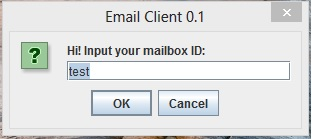
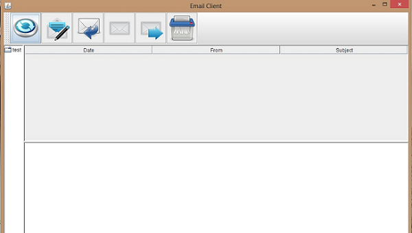
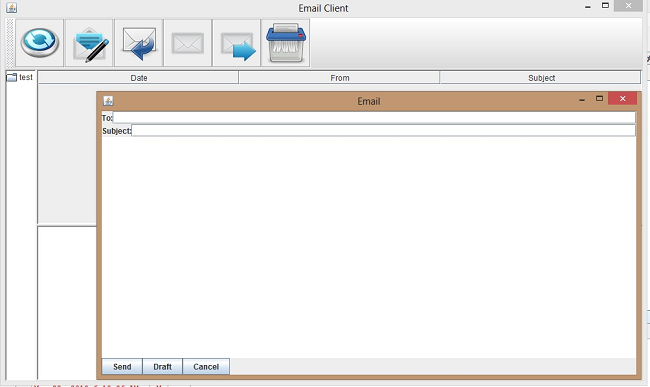

SOEN 6441/1 Collaborative Email Client
======================================

Inital Phase Development
----------------------
 * Compose New Email
 * Save Draft Email
 * Display Your inbox folder hiearchy
 * Create Sub folders
 * Move mail to sub folders
 * Have a send mail functionality that moves email to a Sent and ToSend folder
 * All functionalites should have menu, right mouse click and hot keys
 * delete an email from folders
 * delete folders except top level inbox

###Project Details:

| LANGUAGE      | IDE USED      | TEST TOOL  |
| ------------- |:-------------:| ---------: |
| JAVA SWINGS   | NetBeans 7.3  |  Emma      |

###Initail GUI:

>Email Client ID gui gets userID from the user to create a new Email client for the particular user.

- Email client window appears by the user ID
    - If the userID is new, then new window is created with USER folder on the top and Inbox, Outbox, Sent and Trash as the second level of the folder layer which cannot be deleted or changed by th user.
    

 - When the userID is old then the respective folders and messages of the user is retrieved from the persistent storage system.

####Compose a New Mail :
Compose Mail Window is a common window created from Send New Mail, Reply To Mail and Forward Mail. Where the compose mail window act accordingly.

 

#### Send New Mail:
 - When user click send mail either in toolbar or using Hotkey, sendmail event is created which intialize compose mail window 
 - Sequence Diagram for the send mail 

 - Send mail gets input from the user using compose mail window, move the mail to send folder in the tree bar.
 - Save or Delete mail event enable the user to send request either to move the mail to the drafts folder or trash folder and finally updates the tree bar
   
#### Reply To Mail:
 - When user click Reply mail either in toolbar or using Hotkey, ReplyMail event is created which intialize compose mail window with prefilled from, to, subject and body of the mail 
 - Sequence Diagram for the Reply mail 

 - Reply mail gets input from the user using compose mail window, move the mail to send folder in the tree bar.
 - Save or Delete mail event enable the user to send request either to move the mail to the drafts folder or trash folder and finally updates the tree bar.
   
####Forward Mail:
 - When user click Forward mail either in toolbar or using Hotkey, ForwardMail event is created which intialize compose mail window with prefilled from, subject and body of the mail 
 - User has to fill in the to text field, to send the mail to the particular user 
 - Sequence Diagram for the send mail 

 - Reply mail gets input from the user using compose mail window, move the mail to send folder in the tree bar.
 - Save or Delete mail event enable the user to send request either to move the mail to the drafts folder or trash folder and finally updates the tree bar.
    
### Folder Options:
> User are provided with various kinds of folder options and also restrictions, 
**Creating**
     Users are allow to create new folder inside only inbox. Not on other top level olders. 
**Deleting**
     Users are allow to delete only the mails and sub level folders in their tree bar.
**Re-Naming**
     Users are only allowed to rename their sub folders.
     
 - Folder Option:
   - Add Folder 
   - Delete Folder
   - Move Folder
   - Move Mails to folder

#### Create New Folder:
> Users are allowed to create new folder only inside INBOX, and this create event enables the user access options like move mail, move folder options.

##### Add Folder 
> Add folder event (other version of Create new folder) is enabled only inside INBOX and its sub-Folders, the seuence diagram for the add folder event follows

#### Move Folder
> Move folder event allows the user to move the mails across the folders and subfolders inside the INBOX, the sequence diagram of the Move folder follows. 

#### Delete Folder

> Delete event is enabled only inside the toplevel folders , you can delete folders and mails inside th folders. Depending upon the reply from the user delete folder event has two action one which deletes only the folder and moves the mail to the parent folder. Other action deletes entire folder with mails inside it.
  
  - Sequence diagram for the delete folder is as follows

### Dispaly Folder In Hiearchy:

> Dispaly folder event uptades the hiearchy in the Jtree, when ever events regarding the folder event like, Move Folder, Deleted Folder and Add folder.   
> Deleteing mails also leads to the update in the Jtree but displayed in the JText box created in the display event.

### Right Click And Hot Keys:

> Right Click Event is enabled for all events in the GUI, 

      
| ToolBar        | Hot Key       |
| -------------  |:-------------:|
| Compose Mail   | Alt + N       | 
| Reply Mail     | Alt + R       | 
| Delete Mail    | Alt + D       | 
| Forward Mail   | Alt + F       | 
| Refresh Mail   | F5            |        
      